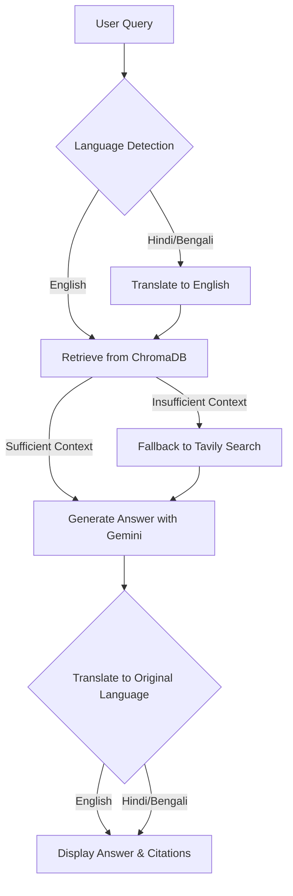

# 🌟 Mini-RAG Bot: Your Trusted AI Companion for Women’s Health FAQs 🌟

<!-- Shields/Badges go here, e.g., for build status, license, etc. -->
[](https://www.python.org/)
[](https://github.com/langchain-ai/langchain)
[](https://ai.google.dev/models/gemini)
[](https://www.trychroma.com/)
[](https://tavily.com/)
[](https://streamlit.io/)

**Built by Harsh Dayal for Aaroogya AI**

## ✨ Project Overview

Empowering individuals with accurate and accessible health information is crucial. This project introduces a **Retrieval-Augmented Generation (RAG) chatbot** specifically designed to provide reliable answers to **women's health-related questions**. Beyond basic Q&A, this bot offers:

*   **Intelligent Information Retrieval**: Seamlessly ingests diverse document types (PDFs, HTML) and leverages both a local knowledge base (ChromaDB) and real-time web search (Tavily AI) for comprehensive answers.
*   **Contextual Accuracy with Citations**: Delivers precise information backed by verifiable sources, ensuring trustworthiness and enabling users to delve deeper.
*   **Multilingual Accessibility**: Bridging language barriers, the bot supports queries and responses in **Hindi, Bengali, and English**, making vital health information accessible to a wider audience.

This bot aims to be a valuable resource for quick, accurate, and culturally relevant women's health information.

## 📦 Architecture & Technology Stack

The Mini-RAG Bot is engineered with a robust and modular architecture, utilizing leading-edge technologies to deliver its intelligent capabilities:

- **Orchestration & RAG**: LangChain is used for orchestrating the RAG pipeline, including document loading, splitting, embedding, and generation.
- **Document Loaders**: `PyPDFLoader` for PDFs and `BeautifulSoup` for HTML.
- **Text Splitter**: `RecursiveCharacterTextSplitter` to break down long documents into smaller chunks.
- **Embedding Model**: `HuggingFaceEmbeddings` with the `sentence-transformers/all-MiniLM-L6-v2` model.
- **Vector Store**: ChromaDB for storing and retrieving document embeddings.
- **Generator**: Google's Gemini model for generating answers.
- **External Knowledge**: Tavily Search API for real-time web retrieval as a fallback.
- **Multilingual Support**: `google-trans-new` for translating queries to and from English.

## 📊 Mermaid Diagram



## ⚙️ Setup & Installation

To get the Mini-RAG Bot up and running, follow these simple steps:

1.  **Clone the repository:**
    ```bash
    git clone https://github.com/Kaos599/AaroogyaAI-Assignment.git
    cd mini_rag_bot
    ```

2.  **Create and activate a virtual environment:**
    ```bash
    python -m venv venv
    # On Windows
    .\venv\Scripts\activate
    # On macOS/Linux
    source venv/bin/activate
    ```

3.  **Install dependencies:**
    ```bash
    pip install -r requirements.txt
    ```

4.  **Set environment variables:**
    Obtain your API keys from Google AI Studio (for Gemini) and Tavily AI. Then, create a `.env` file in the root directory of the project and add your API keys as follows:
    ```
    GEMINI_API_KEY="your_gemini_api_key"
    TAVILY_API_KEY="your_tavily_api_key"
    ```
    Alternatively, you can set these as environment variables in your shell.

## 🚀 Usage

Once set up, the application can be run in two primary modes: a command-line interface (CLI) for quick interactions and a Streamlit web application for a more interactive experience.

### Command-Line Interface (CLI)

The CLI allows you to interact with the bot directly from your terminal. There are two main commands: `ingest` to process documents and `ask` to query the bot.

**1. Ingesting Documents:**

To add a document to the bot's knowledge base, use the `ingest` command. For example, to ingest a PDF file:

```bash
python -m mini_rag_bot.src.app ingest --document_path "path/to/your/document.pdf"
```

Replace `"path/to/your/document.pdf"` with the actual path to your PDF or HTML document. Supported formats are `.pdf` and `.html`.

**2. Asking Questions:**

To ask the bot a question, use the `ask` command, followed by your query in quotes:

```bash
python -m mini_rag_bot.src.app ask "What are the dietary recommendations for someone with anemia?"
```

Example Output:

```
Answer: For anemia, it is recommended to eat iron-rich foods like spinach, red meat, and lentils [source: 1].
Citations: ['[1] https://example.com/anemia_diet']
```

### Streamlit Web Application

For an interactive chat experience, you can run the Streamlit application. This provides a user-friendly interface to upload documents and ask questions.

To launch the Streamlit app, execute the following command in your terminal:

```bash
streamlit run mini_rag_bot/src/app_streamlit.py
```

This command will open the application in your default web browser. From there, you can easily upload your documents (PDFs or HTML files) and interact with the chatbot through a conversational interface.

